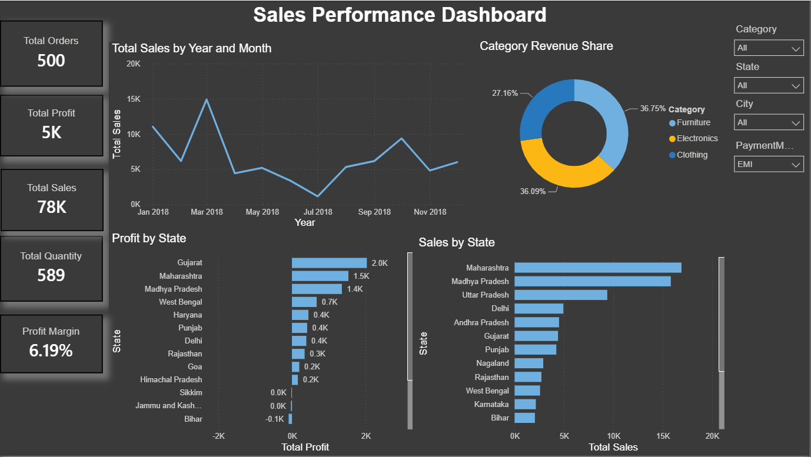
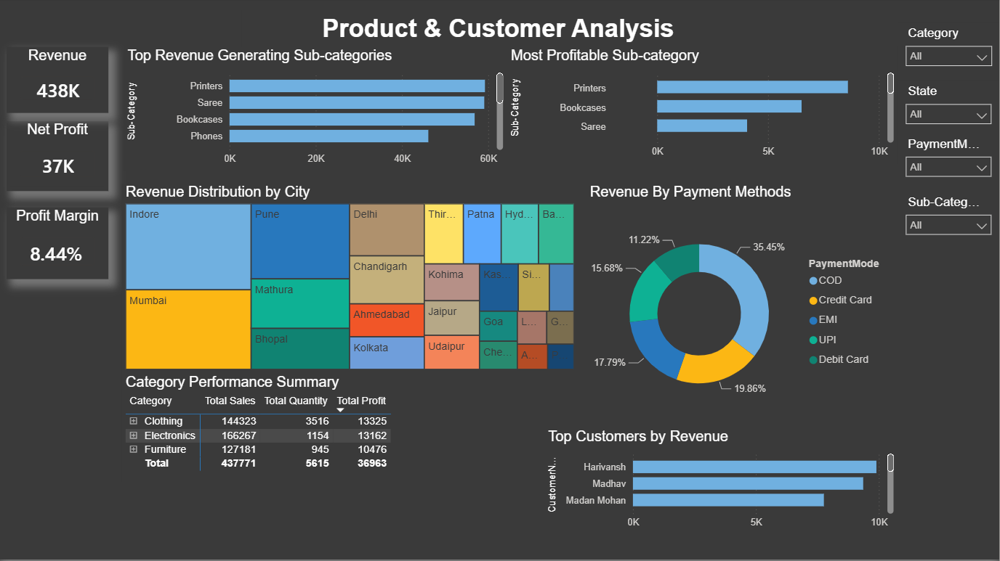
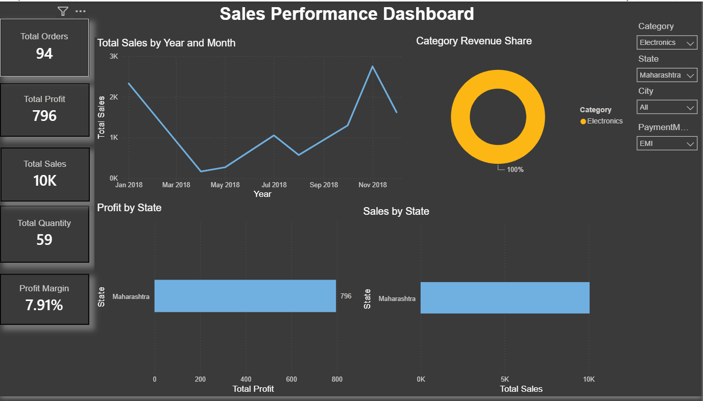
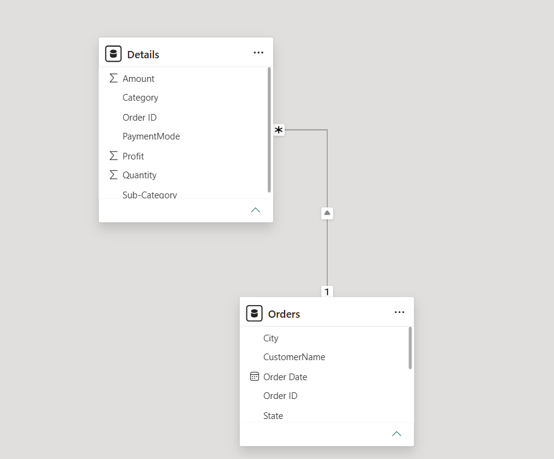

# 📊 E-Commerce Sales Dashboard | Power BI

## Overview

This project presents an interactive E-Commerce Sales Dashboard built using Power BI. The dashboard provides insights into revenue, profitability, customer purchasing behavior, product performance, and geographical sales distribution.

The objective of this project is to transform raw sales data into actionable business insights through interactive visualizations and KPI-driven reporting.

---

## Dataset

The project utilizes two datasets:

### Orders Dataset

Contains order-level information including:

* Order ID
* Order Date
* Customer Name
* City
* State

### Details Dataset

Contains transaction-level information including:

* Order ID
* Amount
* Profit
* Quantity
* Category
* Sub-Category
* Payment Mode

A relationship was established between both datasets using the **Order ID** field.

---

## Dashboard Features

### Executive Overview

* Revenue Analysis
* Net Profit Tracking
* Profit Margin Monitoring
* Monthly Sales Trends
* State-wise Sales Performance
* State-wise Profitability
* Category-wise Revenue Distribution

### Product & Customer Analysis

* Top Revenue Generating Sub-Categories
* Most Profitable Sub-Categories
* Revenue Distribution by City
* Revenue by Payment Method
* Category Performance Summary
* Interactive Filtering & Drill-down Analysis

---

## Key Performance Indicators (KPIs)

| KPI             | Description                |
| --------------- | -------------------------- |
| Revenue         | Total sales generated      |
| Net Profit      | Total profit earned        |
| Profit Margin % | Profitability ratio        |
| Total Orders    | Number of completed orders |
| Total Quantity  | Units sold                 |

---

## Dashboard Screenshots

### Executive Dashboard



---

### Product & Customer Analysis



---

### Interactive Filtering Example



---

### Data Model



---

### Development View


---

## Data Model

The dashboard follows a relational data model:

Orders (1) ─────── (*) Details

The relationship is established through the **Order ID** field, enabling seamless cross-filtering and aggregation across both datasets.

---

## Tools & Technologies

* Power BI Desktop
* Microsoft Excel
* DAX (Data Analysis Expressions)
* Data Modeling
* Git & GitHub

---

## Key Insights

* Electronics generated the highest overall revenue.
* Revenue distribution varies significantly across cities and states.
* Certain sub-categories contribute disproportionately to profit.
* COD remains one of the dominant payment methods.
* Profitability trends differ from revenue trends across product segments.

---

## Repository Structure

```text
powerbi-sales-dashboard/
│
├── data/
│   ├── Orders.xlsx
│   └── Details.xlsx
│
├── dashboard/
│   └── Sales_Dashboard.pbix
│
├── screenshots/
│   ├── dashboard-overview.png
│   ├── product-analysis.png
│   ├── filtered-view.png
│   ├── data-model.png
│   └── powerbi-development-view.png
│
└── README.md
```

---


